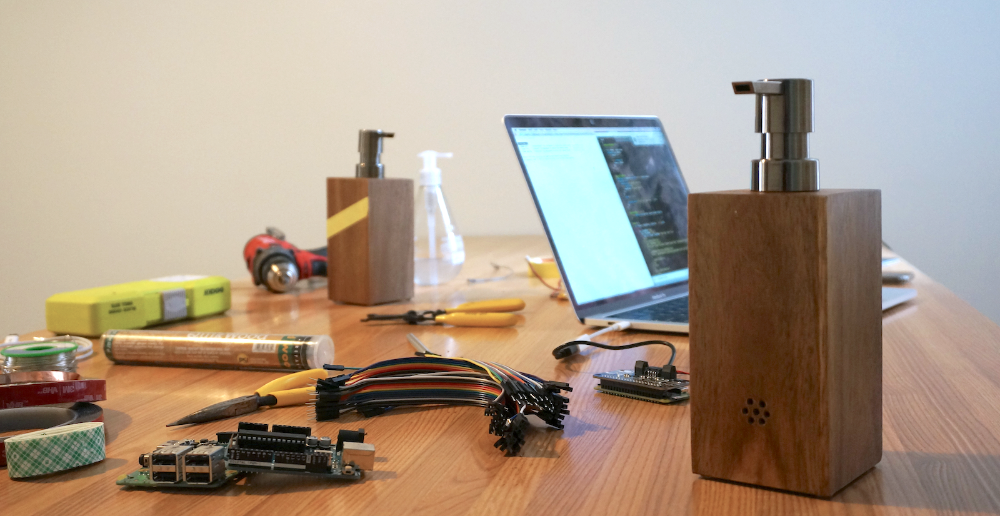
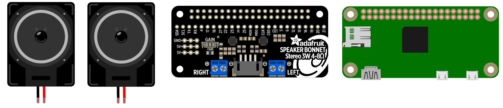
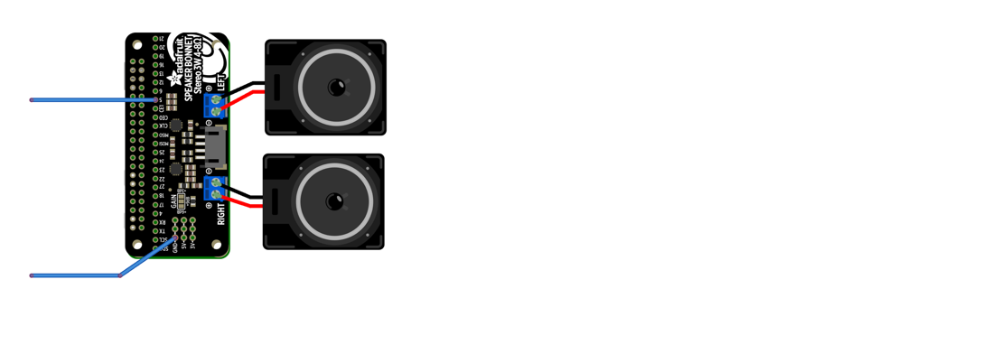

# Scrubber


Social distancing at home but wishing you were getting down at the club? Tired of the 20 seconds of lathering feeling like the longest 20 seconds of your life? Looking for a DIY project to do in quarantine? Scrubber's got you covered!

Scrubber is your handwashing soundtrack — 20 seconds of music selected right from your most played Spotify tracks of the week. All you need is a soap dispenser, a Spotify account, and the electronic parts listed below. Check out more of this project at [Deeplocal.com/Scrubber](www.deeplocal.com/scrubber), and keep reading to learn how to build your own.

## Project Information

- **Estimated time to assemble:** 4 hours
- **Difficulty:** Beginner/Intermediate 
- **Cost:** About $30

**Features:**

- Pump-triggered music that times your hand washing 
- Simple parts that you can adjust for whatever soap dispenser you use
- Spotify integration to play your favorite jams 

**System Overview:**


Scrubber uses Spotify's API wrapped in a custom Node script. The script authenticates with Spotify, downloads and proccesses tracks, then plays audio through the speaker bonnet using ALSA. That may sound a little complex, but we've written these steps  and the code in this repo so anyone can follow along.

## What You'll Need



Before you get started, you should have some basic knowledge of command line linux and soldering. You'll also need the parts and tools listed below. This repo contains all the code and documentation you'll need to get your Scrubber up and running.

### Electrical Parts

- Raspberry Pi Zero W
- Adafruit Speaker Bonnet & Speaker
- ~1-2ft of thin wire (around 22 awg)
- A few inches of copper tape
- Battery pack (optional)

Most of these parts can be swapped for what you have access to — the speaker bonnet can be replaced with a similar audio pHat or AIY hat, and the copper tape can even be replaced with aluminum foil and super glue.

### Tools

- Tiny screwdrivers
- X-ACTO knife or scissors
- Soldering Iron
- Wire cutters
- Wire strippers
- Tools to modify your soap dispenser (scissors, drill, etc.)

## Assembly

Let's get down to it— start by connecting your Pi to your wireless network. If you don’t know how, here’s a great guide (link). Make sure you can SSH into your Pi and can find you Pi’s local IP address.

### Hardware



1. Power down your Pi.

2. Press the Adafruit Sound Bonnet onto the Pi's headers.

3. Locate Pin 5 and ground **on the sound bonnet** and solder ~6in of your thin wire to each.

   


4. [Optional] Attach a battery pack — we did this but you definitely don’t need to. 

Once you’re all put together, we’re ready to head to software.

### Software

1. On your computer (not the Pi), head to Spotify [dashboard](http://link). 

2. Click *Create an app*, call it *Scrubber,* and set the description to *Scrubber*. Select “Speaker” on the checklist, and then click next. Assuming you're using this for a non-commerical application, click non-commerical, then read the terms and conditions, check the boxes, and hit submit. You’ll now be sent to your Scrubber app's dashboard page.

3. Note down your Client ID and your Client Secret (we’ll need those in a bit!)

4. Click *edit settings,* then add http://<Your Raspberry Pi’s ip>:5000 to the redirect URIs. So if your Pi IP was 192.168.1.232, you'd enter http://192.168.1.232:5000 and hit add then save. 

5. SSH into your Pi, and create a directory to house Scrubber in.

   `mkdir Projects`

6. Navigate into the directory  

   `cd Projects` 

7. Set up the Speaker Bonnet with Adafruit's installer – yup, you do actually have to run the script and reboot twice. 

   1. `curl -sS https://raw.githubusercontent.com/adafruit/Raspberry-Pi-Installer-Scripts/master/i2samp.sh | bash` 
   2. `sudo reboot now ` 
   3. `curl -sS https://raw.githubusercontent.com/adafruit/Raspberry-Pi-Installer-Scripts/master/i2samp.sh | bash` 
   4. `sudo reboot now ` 

4. Test out the speaker bonnet 

   `speaker-test -c2 --test=wav -w /usr/share/sounds/alsa/Front_Center.wav`

   and hit ctrl+c to exit. If you don't hear audio, check out Adfruit's [documentation](https://learn.adafruit.com/adafruit-speaker-bonnet-for-raspberry-pi/raspberry-pi-usage) for troubleshooting

5. Ensure you're in your Projects folder, and clone this repository

   `git clone https://github.com/Deeplocal/scrubber.git`

6. Install Node and NPM (we're using version 10.15.2, but any recent version should be fine)

   `curl -o- https://raw.githubusercontent.com/nvm-sh/nvm/v0.34.0/install.sh | bash` 

   `nvm install node` 

1. Enter the scrubber directory

   `cd scrubber` 

11. Install all the relevant packages (this may take a while, but don't worry. Consider washing your hands while you pass the time)

    `npm i` 

12. Start the script by typing `node index`, then wait for the below instructions to appear in your command line to link your Spotify account:

    I. Paste your Client ID from earlier, and hit enter

    II. Paste your Client Secret from earlier, and hit enter

    III. In your browser, go to http://<Your Raspberry Pi’s ip>:5000 and hit Log in with Spotify 

    IV. Copy the code from your browser and enter it into your SSH session when requested— then wait (several minutes) for the download to complete— you'll hear a 20 second clip play when it's all been proccessed.

13. Test the system by touching PIN5 and Ground wire! You should hear 20 seconds of audio!

    #### Running on Boot

    After we've run the script for the first time, we can optionally set the script to run on boot. This means you don't have to SSH into Scrubber everytime you power up. 

    Edit the file `/etc/rc.local` 

    ```
    sudo nano /etc/rc.local
    ```

    Add this line: `cd /home/pi/Projects/scrubber && node index.js` just above the `exit 0` at the end of the file. Then save the file and close it. And reboot your pi with `sudo reboot now`. Give it a few minutes to boot up, then test your configurtation by touching PIN5 and Ground wire. Enjoy those 20 seconds of music!


##Putting it all together

Now we're ready to put it all together— there’s a million different soap dispensers out there, so we’ll show you one simple way to trigger your music that can be adapted to almost any type of dispenser. We want the pump to trigger the audio, so we’ll be using copper tape to make the pump act just like a button.

1. Grab your copper tape, and place two strips on the pump just such that they make contact when the bottle is pressed. Check out ours in the .gif below. No copper tape? No problem. You can use glue and aluminum foil to achieve a similar effect.

2. Gently solder those ground and Pin5 wires to the copper tape. Now, when the two copper strips make contact, the Pi will perceive a button press.

   

And that’s it! You’ve got your very own Scrubber! 🧽 Smash that pump for 20 seconds of hand washing dance party energy.

## Notes

Scrubber was concepted, designed, built, and launched during the week of 3/16/20. This project presented new and interesting challenges due to Deeplocal staff working from home. Part of this project was an exploration of remote creative collaboration for physical projects. Scrubber was fabricated in home makerspaces across Pittsburgh, with remote support from our creative and engineering teams. 

The team behind scrubber includes Adnan Aga (Creative/Software), Taylor Tabb (Creative/Hardware), Caroline Fisher (Creative), Colin Miller (Creative/Design), Erin Pridemore (Design), and Matthew Pegula (Creative).
